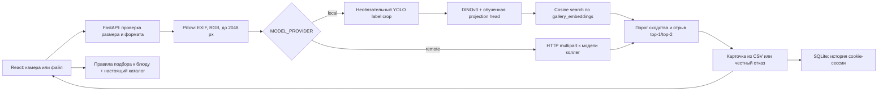

# Архитектура winescanner

## Границы слоёв

`frontend/src/App.tsx` — мобильные и настольные страницы сканера, карточки, каталога, коллекции, истории и подбора к блюду. `api.ts` — типизированный HTTP-клиент. `styles.css` — адаптивный интерфейс. Шрифты поставляются npm-пакетами и включаются в сборку. Фронтенд не знает о PyTorch, GPU, путях к весам и ключах внешнего сервиса.

`backend/main.py` — HTTP-контракт, жизненный цикл, ограничения тела запроса, нормализация изображения и выбор итогового результата. Принимаются только декодируемые JPEG/PNG/WebP, проверяется реальный формат, размер тела и число пикселей. Сетевые запросы и инференс исполняются в thread pool, не блокируя event loop. Одновременный inference ограничен одним запросом, чтобы не переполнить GPU.

`backend/providers.py` — общий `predict(PIL.Image) -> Prediction` и три адаптера. Demo запрещает реальное распознавание; специальный `/api/demo` сохраняется как технический пример для интеграции и не вызывается пользовательским интерфейсом. В интерфейсе нет статусов подключения модели; при ошибке распознавания показывается понятное сообщение и переход в каталог. Local импортирует существующую архитектуру, eval transforms и совместимость checkpoint-ключей только при выбранном локальном режиме. Remote отправляет файл на заранее заданный сервер, проверяет схему, не следует редиректам, не отдаёт ключ API фронтенду.

`backend/catalog.py` — единый источник карточек. Читает распакованный CSV или каталог из ZIP; изображения доступны по известным slug, произвольные пути не принимаются. Сначала используются прозрачные эталоны RGBA WebP, затем PNG/JPEG. Изображения ограниченно кэшируются в памяти. Полнотекстовый поиск для 2103 записей выполняется в памяти по названию, региону, сорту и винодельне.

`backend/storage.py` — SQLite/WAL, параметризованные запросы, изоляция истории по случайной HttpOnly cookie, лимит записей и очистка старых данных. Фотографии и секреты в БД не сохраняются. Избранные slug хранятся на устройстве пользователя.

`backend/pairing.py` — дополнительная функция после поиска. Выбирает вина из настоящего каталога по блюду и предпочтению стиля, разнообразит винодельни и объясняет общий принцип сочетания. Сладкие десерты требуют сладкого стиля. Пользователь не получает выдуманных дегустационных данных или оценок.

## Модель и достоверность

Local повторяет eval-преобразования обучения: padding до квадрата, bicubic resize, ImageNet normalization. DINOv3 строит CLS + среднее patch features, projection head выдаёт нормализованный embedding. Top-k выбирается скалярным произведением с нормализованной галереей на выбранном устройстве. Checkpoint и gallery загружаются один раз, модель переводится в eval и прогревается. PyTorch читает deployable checkpoints с `weights_only=True`.

`best.pt` и галерея должны происходить из одной версии обучения. Проверяются размерность, уникальность и существование slug, конечность и ненулевая норма векторов. Автоматически доказать происхождение галереи без общего training manifest нельзя — это часть контракта передачи артефактов коллегами.

При `similarity >= MIN_SIMILARITY` и `top1 - top2 >= MIN_MARGIN` клиенту отдаётся одна карточка. Низкое сходство даёт `not_found`, небольшой отрыв — `uncertain`. Наличие near-duplicates требует калибровки порогов на реальных фото; готовые пороги не являются гарантией точности. `abstain` от детектора/внешней модели приоритетнее численного сходства. Неизвестные slug не пропускаются с продвижением следующего кандидата: такой ответ — ошибка интеграции.

`similarity` — cosine score, не вероятность и не F1. Датасетные F1/Recall/latency измеряет `scripts/evaluate_api.py`, а `backend/metrics.py` читает проверенный по схеме отчёт. До оценки значения `null`. Отчёт содержит версии, объём выборки, формулы и время прогона; ответы указывают, соответствует ли версия отчёта текущей модели.

## Запуск и масштабирование

Разработка: Vite proxy `/api` → FastAPI. Production build: один FastAPI-процесс раздаёт `/`, `/assets`, `/api` и `/predict`. `npm run dev` запускает обе службы, `docker compose` — единый лёгкий контейнер с внешним inference API или demo.

Для локальной демонстрации достаточно памяти под каталог, SQLite и CPU/GPU под модель. Публичный production потребует отдельной аутентификации, ограничения частоты запросов, TLS, политики хранения, устойчивых очередей и процесса синхронизации каталога/галереи. Эти механизмы намеренно не имитируются в демонстрации.

## Проверки

API-тесты используют маленький независимый каталог и провайдер с контролируемыми ответами: проверяют не только успешный путь, но и near-duplicates, неизвестные вина, несогласованный каталог, невалидные изображения/ответы, ограничения, изоляцию истории и честность demo. Браузерные проверки проходят по реальному каталогу и backend в desktop/mobile viewport, проверяют навигацию, карточку вина, коллекцию, историю, поиск, подбор и понятную обработку недоступности распознавания.

Реальная точность DINOv3, latency на GPU и работа конкретного внешнего inference API требуют артефактов/сервиса коллег. Эти измерения отделены от функциональных тестов приложения.
