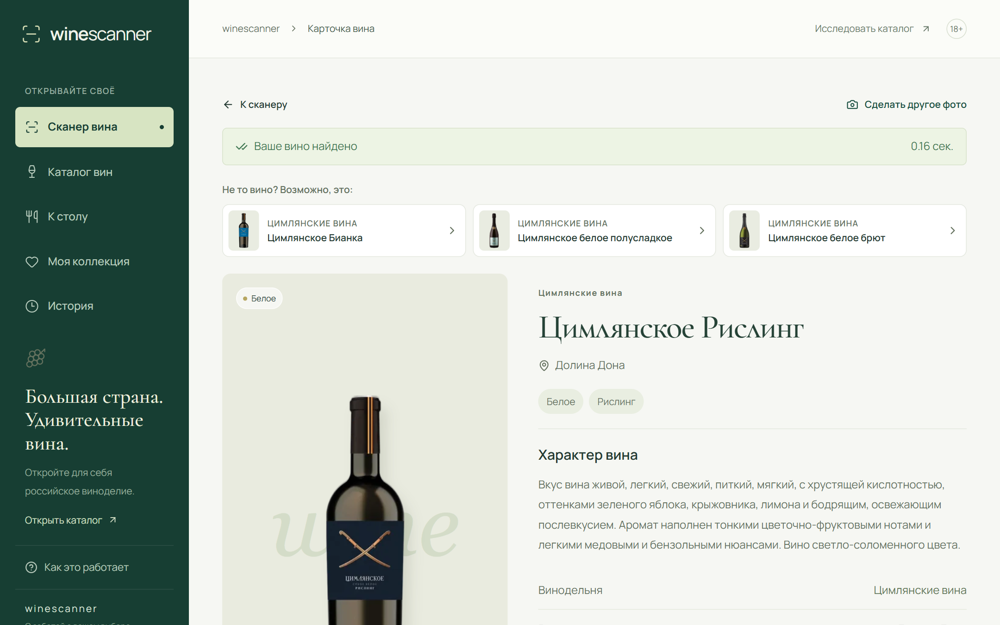
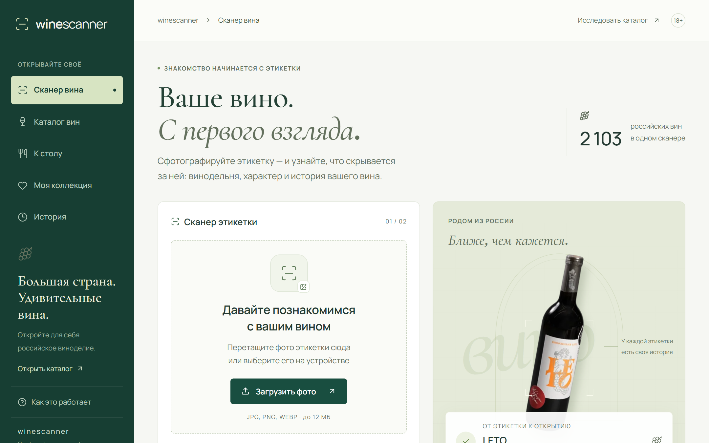
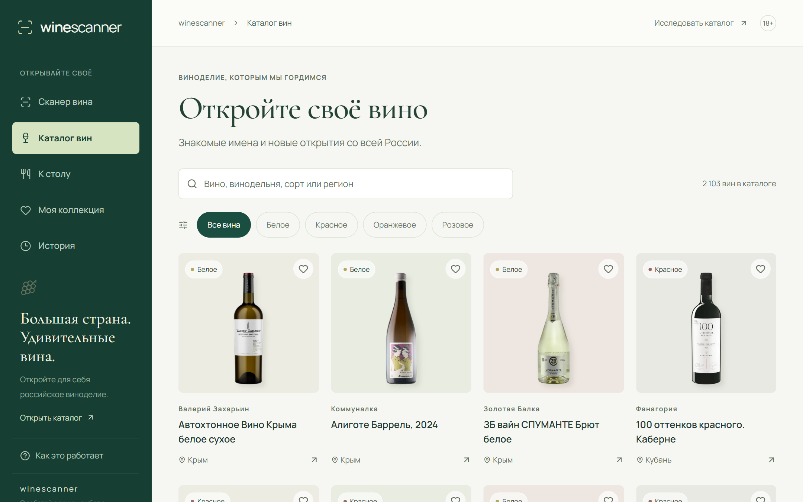
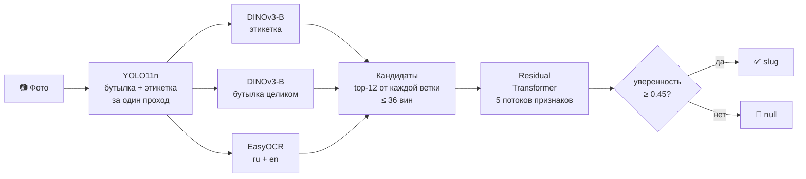

<div align="center">

# 🍷 winescanner

**Сфотографируйте этикетку — и узнайте вино.**<br>
Сканер российских вин: 2 103 вина из каталога «Своё вино», ответ за доли секунды,<br>
честное «не знаю» для вин, которых в каталоге нет, и сомелье, который подберёт вино к ужину.

[](https://github.com/melnikovknst/VIscaNEr/actions/workflows/ci.yml)




</div>

---

## 🚀 Запуск одной командой

Ubuntu 22.04 / 24.04, нужны только `git` и `sudo`:

```bash
git clone https://github.com/melnikovknst/VIscaNEr.git && cd VIscaNEr && ./run.sh
```

`run.sh` сам:

1. поставит Docker и Git LFS, если их нет;
2. скачает веса моделей и каталог (~1 ГБ);
3. соберёт образ **на GPU**, если есть видеокарта NVIDIA с NVIDIA Container Toolkit, иначе **на CPU**;
4. дождётся загрузки моделей и напечатает адреса.

Первый запуск занимает 5–10 минут (сборка образа), следующие — секунды.

| Что | Где |
|---|---|
| Сайт | http://127.0.0.1:8080 |
| Эндпоинт для проверки | `POST http://127.0.0.1:8080/v1/eval/predict` |
| Документация API (Swagger) | http://127.0.0.1:8080/docs |

```bash
./run.sh logs     # журнал
./run.sh stop     # остановить
./run.sh --cpu    # принудительно на CPU
```

## 🧪 Проверка скриптом организаторов

Сервис принимает фотографию в multipart-поле `image` и возвращает top-1 `slug`:

```bash
curl -F image=@photo.jpg http://127.0.0.1:8080/v1/eval/predict
# {"slug":"czimlyanskoe-risling"}
```

Если вина нет в каталоге или модель не уверена, ответ — `{"slug":null}`: честный отказ
вместо угадывания.

```bash
./participant_test.sh \
  --images-dir ./queries \
  --manifest ./queries.tsv \
  --endpoint 'http://127.0.0.1:8080/v1/eval/predict' \
  --output ./predictions.jsonl
```

Запросы обрабатываются строго по одному: 0.1–0.4 с на фото на RTX 5070. На CPU
сервис тоже работает, но медленнее.

## ✨ Что умеет

<table>
<tr>
<td width="50%"></td>
<td width="50%"></td>
</tr>
</table>

- **Сканер этикетки** — загрузите фото или снимите камерой телефона. Можно снимать
  прямо на полке магазина: сканер выбирает бутылку у центра кадра.
- **Честные ответы** — уверенно узнанное вино открывается сразу. Если похожих
  этикеток несколько, сайт предлагает выбрать из кандидатов, а не выдаёт догадку за ответ.
- **Каталог** на 2 103 вина с поиском по названию, винодельне, сорту и региону.
- **«К столу»** — подбор вина к блюду. С включённым сомелье выбор объясняет
  языковая модель, опираясь только на данные каталога; без него работают редакционные правила.
- **Коллекция и история** сканирований — в браузере посетителя, без регистрации.

## 🧠 Как это работает



1. **Детектор** (YOLO11n, дообучен на размеченных фото полок) за один проход находит
   бутылки и этикетки и выбирает цель: уверенность детектора плюс бонус за близость
   к вертикальной оси кадра — туда, куда человек наводит камеру.
2. **Два энкодера DINOv3-B/16**, дообученных на поиск по каталогу: один сравнивает
   этикетку с эталонными этикетками каталога, второй — бутылку целиком (форма, цвет
   стекла, капсула).
3. **EasyOCR** читает текст этикетки; его символьные n-граммы сравниваются с названиями вин.
4. Каждая ветка предлагает 12 ближайших вин, объединённый пул (до 36) переранжирует
   **residual Transformer**: он видит все пять потоков признаков запроса и кандидатов
   и учится исправлять ошибки отдельных веток.
5. **Уверенность** — softmax по логитам top-10 кандидатов. Ниже порога 0.45 сервис
   отвечает `null`.

Подробности, форматы весов и обоснование порога — в [docs/ARCHITECTURE.md](docs/ARCHITECTURE.md).

## ⚙️ Настройки

`run.sh` при первом запуске создаёт `.env` из [.env.example](.env.example). После
правки перезапустите `./run.sh`.

| Переменная | По умолчанию | Смысл |
|---|---|---|
| `PORT` | `8080` | Порт сайта и API |
| `VISCANER_DEVICE` | `auto` | `auto`, `cuda` или `cpu` |
| `VISCANER_MIN_CONFIDENCE` | `0.45` | Ниже — `/v1/eval/predict` отвечает `null` |
| `VISCANER_MIN_SUGGEST_CONFIDENCE` | `0.20` | Ниже — сайт не предлагает кандидатов |
| `VISCANER_SOMMELIER_ENABLED` | `false` | Включить сомелье на языковой модели |
| `VISCANER_OPENROUTER_API_KEY` | — | Ключ [OpenRouter](https://openrouter.ai/keys) для сомелье |
| `VISCANER_OPENROUTER_MODEL` | `anthropic/claude-sonnet-5.5` | Любая чат-модель OpenRouter |

Сомелье по умолчанию выключен, потому что ему нужен ключ API и интернет. С ним
вкладка «К столу» и карточки вин получают чат, который подбирает вина из каталога
и объясняет выбор. Поиск по каталогу (bge-m3) идёт локально, во внешний API уходит
только генерация ответа.

## 🗂 Структура

```text
├── run.sh                    запуск одной командой
├── Dockerfile, compose*.yaml сборка: React-фронтенд + FastAPI + модели в одном образе
├── backend/                  FastAPI: сканирование, каталог, история, сомелье, подбор к столу
├── five_stream_transformer/  инференс: энкодеры DINOv3, OCR-признаки, Transformer
├── joint_yolo/               детектор бутылки и этикетки, выбор цели в кадре
├── frontend/                 React + TypeScript + Vite
├── models/                   веса (Git LFS, ~0.9 ГБ) с описанием и SHA-256
├── data/                     каталог, эталонные галереи, профили вин для сомелье
└── docs/                     архитектура и скриншоты
```

## 🛠 Разработка без Docker

```bash
python3 -m venv .venv && source .venv/bin/activate
pip install torch==2.11.0 torchvision==0.26.0 --index-url https://download.pytorch.org/whl/cu128
pip install -r requirements.txt pytest
npm ci && npm run build          # фронтенд в dist/, его отдаёт тот же сервер
uvicorn backend.main:app --port 8080
```

`npm run dev` поднимает фронтенд с горячей перезагрузкой на :5173 и API на :8000.
Тесты: `pytest backend five_stream_transformer joint_yolo`.

## 🔬 История исследований

Обучение моделей, разметка данных, ноутбуки Kaggle, датасеты и все промежуточные
эксперименты (каскады, классификаторы бутылок, fusion-MLP) лежат в ветке
[`development`](https://github.com/melnikovknst/VIscaNEr/tree/development).

---

<div align="center">
Кейс «Своё вино» · РСХБ.Цифра · ЛЦТ 2026 · <a href="LICENSE">MIT</a>
</div>
